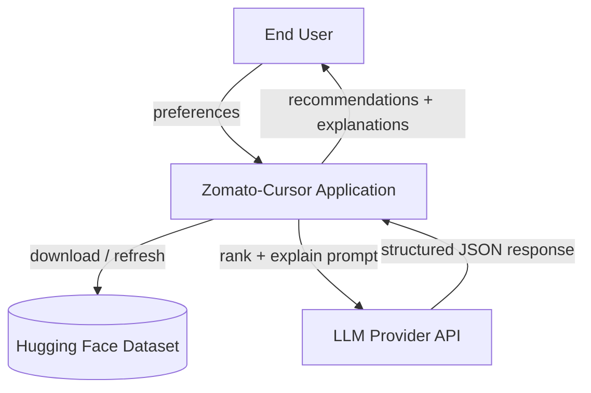
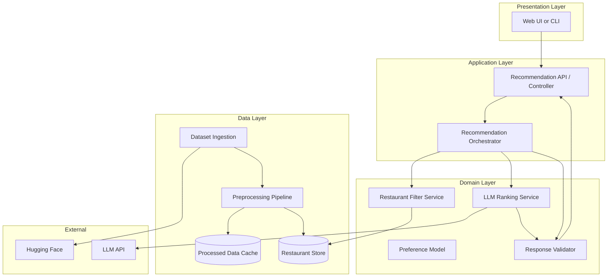
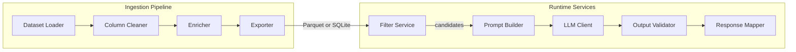
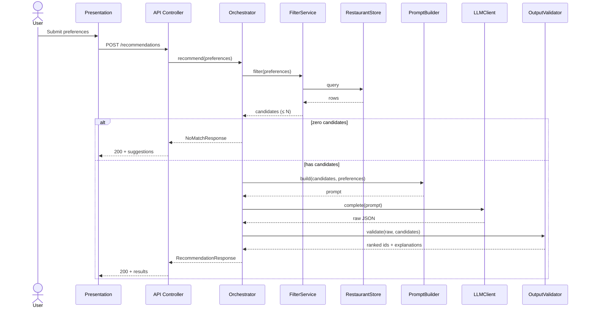
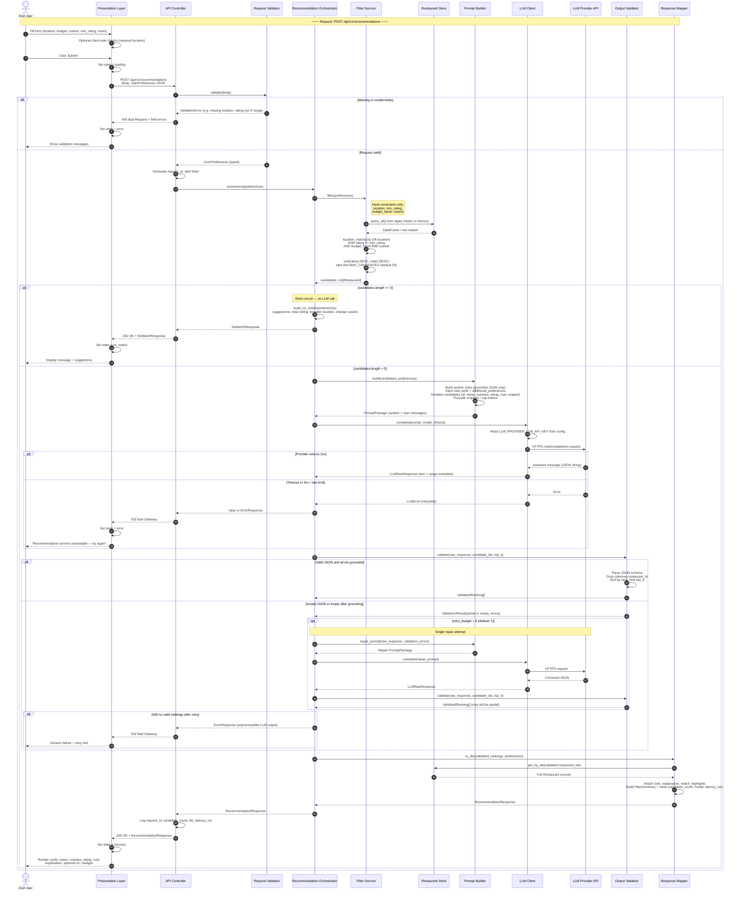
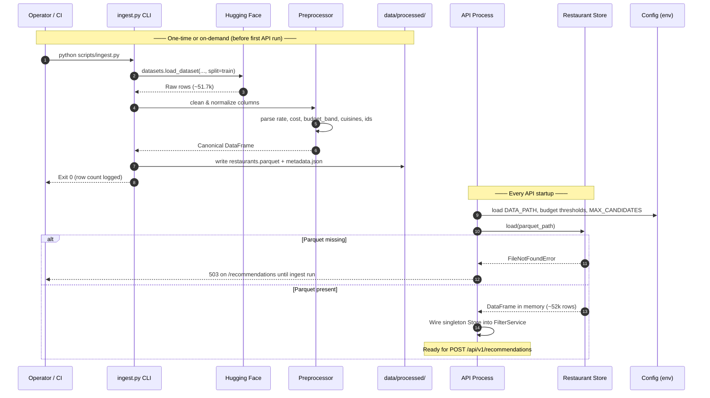
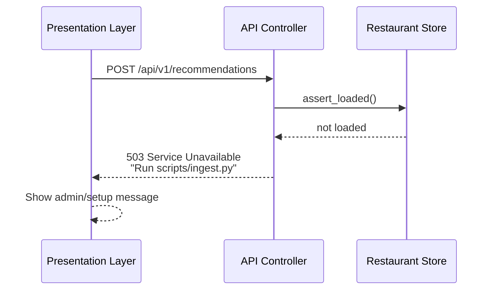
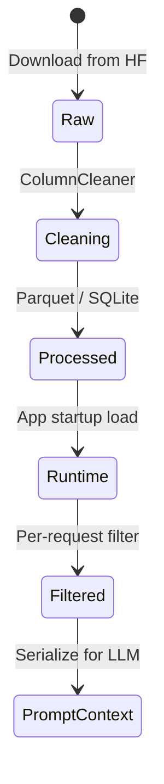
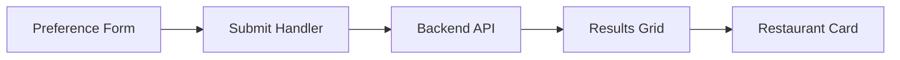
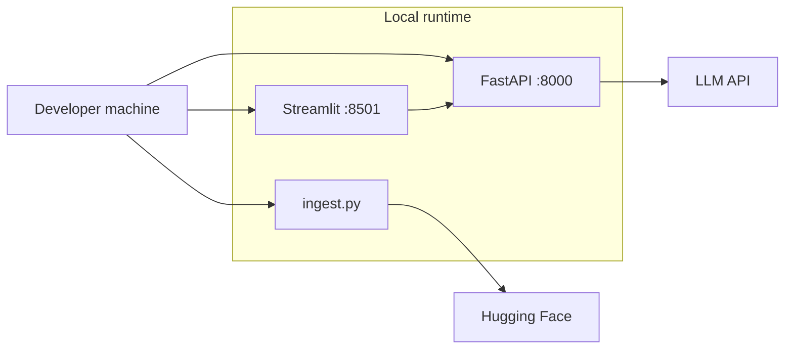

# Zomato-Cursor — System Architecture

This document defines the **detailed technical architecture** for the AI-powered restaurant recommendation system described in [problemStatement.md](./problemStatement.md). It is the blueprint for implementation: components, interfaces, data flows, and operational concerns.

---

## 1. Architectural goals and principles

| Principle | Implication |
|-----------|-------------|
| **Grounded recommendations** | Every surfaced restaurant must originate from the filtered candidate set built from the Hugging Face dataset—never invented by the LLM. |
| **Separation of concerns** | Deterministic filtering (rules/SQL/pandas) is separate from probabilistic ranking (LLM). |
| **Fail closed on hallucination** | Post-LLM validation maps outputs back to candidate IDs/names; unknown venues are dropped or trigger retry. |
| **Portfolio simplicity** | Monolith or modular monolith for v1; no microservices, message queues, or custom ML training. |
| **Configurable intelligence** | LLM provider and model chosen via environment configuration without code changes. |
| **Fast repeat queries** | Preprocessed dataset cached locally; filtering runs in memory or on a local Parquet/SQLite store. |

---

## 2. System context (C4 — Level 1)



**Actors**

- **End user** — Submits location, budget, cuisine, rating, and optional natural-language preferences; reads ranked results.
- **Zomato-Cursor application** — Owns data pipeline, filtering, orchestration, validation, and UI.
- **Hugging Face** — Source of truth for restaurant records (~51.7k rows).
- **LLM provider** — External API (e.g., OpenAI, Anthropic, Google, or local via Ollama) for ranking and narrative explanations.

**Trust boundary** — API keys for the LLM live only on the server/runtime environment, never in client-side code if a web UI is used.

---

## 3. High-level logical architecture



### Layer responsibilities

| Layer | Responsibility |
|--------|----------------|
| **Presentation** | Collect inputs, show loading/error states, render cards with structured fields + AI explanation. |
| **Application** | HTTP/CLI entrypoints, request validation, orchestrate filter → LLM → validate → respond. |
| **Domain** | Business rules: budget bands, location matching, candidate caps, prompt construction, anti-hallucination checks. |
| **Data** | One-time or scheduled ingest, clean schema, persist for fast filtering. |
| **External** | Hugging Face `datasets` load; LLM chat/completions API. |

---

## 4. Component architecture

### 4.1 Component diagram



### 4.2 Component specifications

#### `DatasetLoader`

- **Input:** Hugging Face dataset id `ManikaSaini/zomato-restaurant-recommendation`, split `train`.
- **Output:** Raw dataframe / arrow table.
- **Behavior:** Uses `datasets.load_dataset`; supports offline mode if `data/processed/` already exists.
- **Failure:** Network error → surface “dataset unavailable”; suggest using cached copy.

#### `ColumnCleaner` (preprocessing)

Normalizes raw columns into a **canonical restaurant schema**:

| Canonical field | Source column(s) | Transform |
|-----------------|------------------|-----------|
| `id` | row index or hash of `url` | Stable unique id |
| `name` | `name` | Trim, dedupe display |
| `city` | `listed_in(city)` | Lowercase, strip |
| `location` | `location` | Neighborhood / locality |
| `address` | `address` | Optional display |
| `cuisines` | `cuisines` | Split on `,`, trim, list |
| `rating` | `rate` | Parse `4.1/5` → `4.1` float; null if missing |
| `votes` | `votes` | int |
| `cost_for_two` | `approx_cost(for two people)` | Parse numeric; null if non-numeric |
| `budget_band` | derived from `cost_for_two` | `low` / `medium` / `high` via configurable thresholds |
| `rest_type` | `rest_type` | string |
| `dish_liked` | `dish_liked` | optional string for prompt |
| `online_order` | `online_order` | boolean |
| `book_table` | `book_table` | boolean |
| `url` | `url` | string |
| `review_snippet` | `reviews_list` | Truncate to max chars for LLM context |

**Budget band defaults (configurable):**

| Band | Cost for two (₹) |
|------|------------------|
| `low` | &lt; 400 |
| `medium` | 400 – 800 |
| `high` | &gt; 800 |

#### `RestaurantStore`

- **v1 implementation:** Pandas DataFrame in memory loaded from `data/processed/restaurants.parquet`, **or** SQLite table for simple SQL filters.
- **Query interface:** `filter(preferences) -> List[Restaurant]` + `get_by_ids(ids)`.
- **Indexing:** Optional in-memory indexes on `city`, `location`, `budget_band`, `rating` for speed.

#### `FilterService`

Applies **hard constraints** only (deterministic):

```text
location_match(city OR location contains user location, case-insensitive)
AND rating >= min_rating (if provided)
AND budget_band == user.budget (if provided)
AND cuisines contains user.cuisine (if provided, any match)
```

**Tie-breaking / cap:** Sort by `(rating DESC, votes DESC)`, take top `MAX_CANDIDATES` (default **25**, env-configurable).

**Empty result:** Short-circuit orchestrator; return `NoMatchResponse` with suggestions (relax rating, broaden location, change cuisine)—**no LLM call**.

#### `PromptBuilder`

Builds a **structured prompt** with:

1. System instructions (role, constraints, JSON-only output schema).
2. User preference summary (structured + free-text `additional_preferences`).
3. Filter metadata (how many candidates, applied filters).
4. Candidate table (compact JSON array: id, name, cuisines, rating, cost, location, votes, optional snippet).

Keeps total tokens under model context by truncating `review_snippet` and limiting candidate count.

#### `LLMClient`

- **Interface:** `complete(prompt: PromptPackage) -> LLMRawResponse`
- **Providers (adapter pattern):** `OpenAIProvider`, `AnthropicProvider`, `OllamaProvider`, etc.
- **Config:** `LLM_PROVIDER`, `LLM_MODEL`, `LLM_API_KEY`, `LLM_TIMEOUT_SEC`, `LLM_MAX_RETRIES`
- **Output contract:** JSON schema (see §6.6).

#### `OutputValidator`

- Parse JSON; on failure, optional **one retry** with “fix JSON only” mini-prompt.
- Every `restaurant_id` or `name` in LLM output must match a candidate; drop or flag invalid entries.
- Enforce `top_k` limit (e.g., 5 recommendations).

#### `ResponseMapper`

Merges LLM rankings with **full restaurant records** from the store (address, url, online_order, etc.) and produces the API/UI DTO.

---

## 5. Core domain models

### 5.1 User preferences (`UserPreferences`)

```typescript
// Conceptual schema — implement in Python dataclasses / Pydantic
{
  location: string;           // required — city or locality
  budget?: "low" | "medium" | "high";
  cuisine?: string;           // single cuisine for v1; multi later
  min_rating?: number;        // 0–5
  additional_preferences?: string;  // free text for LLM
  top_k?: number;             // default 5
}
```

### 5.2 Restaurant (`Restaurant`)

Canonical record after preprocessing (see §4.2 `ColumnCleaner`).

### 5.3 Recommendation response (`RecommendationResponse`)

```typescript
{
  summary?: string;                    // optional LLM overview
  filters_applied: FilterSummary;
  recommendations: RankedRestaurant[];
  meta: { candidate_count: number; llm_model: string; latency_ms: number };
}

RankedRestaurant = Restaurant & {
  rank: number;
  explanation: string;
  match_highlights?: string[];         // optional bullets from LLM
}
```

### 5.4 Empty / error envelopes

```typescript
NoMatchResponse { message: string; suggestions: string[]; filters_applied: FilterSummary; }
ErrorResponse { code: string; message: string; retryable: boolean; }
```

---

## 6. Recommendation flow

### 6.1 Sequence overview (happy path)

High-level view of the main request path. See §6.2 for step-by-step detail including validation, retries, and errors.



### 6.2 Detailed recommendation sequence

Full runtime flow from user submit through filter, LLM, validation, mapping, and response. Numbered steps (`autonumber`) match the order of operations in implementation.

**Participants**

| Participant | Layer | Role |
|-------------|-------|------|
| End User | External | Submits preferences; reads results or errors |
| Presentation Layer | UI | Form validation, loading state, renders cards |
| API Controller | Application | HTTP entry, Pydantic parsing, status codes |
| Request Validator | Application | Schema + business rules on `UserPreferences` |
| Recommendation Orchestrator | Application | Coordinates filter → LLM → validate → map |
| Filter Service | Domain | Hard filters, sort, cap `MAX_CANDIDATES` |
| Restaurant Store | Data | In-memory Parquet/DataFrame queries |
| Prompt Builder | Domain | System/user messages + candidate JSON |
| LLM Client | Domain | Provider adapter, timeout, retries |
| LLM Provider API | External | OpenAI / Anthropic / Ollama, etc. |
| Output Validator | Domain | JSON parse, ID grounding, `top_k` enforce |
| Response Mapper | Domain | Merge LLM output with full restaurant rows |



**Step reference (quick lookup)**

| Step | Action |
|------|--------|
| 1–4 | User input and UI loading state |
| 5–6 | HTTP POST to API |
| 7–10 | Request validation; 400 path exits early |
| 11–12 | Orchestrator invoked with typed preferences |
| 13–18 | Filter Service queries Store, applies rules, caps candidates |
| 19–22 | **No-match path:** no LLM; 200 with suggestions |
| 23–26 | Prompt built with grounded candidate list |
| 27–32 | LLM call; 502 on provider failure |
| 33–42 | Validate JSON and IDs; optional one repair retry |
| 43–48 | Map to full DTO; 200 with ranked recommendations |

### 6.3 Application startup sequence

Runs once when the API process starts (FastAPI lifespan). UI and CLI assume this completed successfully.



### 6.4 Error and edge-case flows

Condensed sequences for non-happy paths not fully expanded in §6.2.

**6.4.1 Dataset not loaded (503)**



**6.4.2 LLM returns hallucinated venue id**

```mermaid
sequenceDiagram
  participant Orch as Orchestrator
  participant OutVal as Output Validator
  participant LLM as LLM Client

  Orch->>LLM: complete(prompt)
  LLM-->>Orch: JSON with restaurant_id not in candidates
  Orch->>OutVal: validate(response, candidate_ids)
  OutVal->>OutVal: Strip invalid ids; log warning
  alt Enough valid ids remain (≥ 1)
    OutVal-->>Orch: Partial ValidatedRanking[]
    Note over Orch: Continue to ResponseMapper
  else Zero valid ids after strip
    OutVal-->>Orch: empty + errors
    Orch->>LLM: repair_prompt (opt retry)
  end
```

**6.4.3 Response path summary**

| Condition | HTTP | Response body | LLM called? |
|-----------|------|---------------|-------------|
| Invalid request body | 400 | Validation errors | No |
| Store not loaded | 503 | Setup message | No |
| Zero filter matches | 200 | `NoMatchResponse` | No |
| LLM timeout / provider error | 502 | `ErrorResponse` (retryable) | Yes (failed) |
| Unparseable JSON after retry | 502 | `ErrorResponse` | Yes |
| Success | 200 | `RecommendationResponse` | Yes |

### 6.5 Orchestrator pseudocode

```text
function recommend(prefs):
  validate(prefs)
  candidates = filterService.filter(prefs)
  if candidates.is_empty():
    return NoMatchResponse.with_suggestions(prefs)

  prompt = promptBuilder.build(candidates, prefs)
  raw = llmClient.complete(prompt)  // with timeout + retry

  validated = outputValidator.validate(raw, candidates)
  if validated.is_empty() and retry_budget > 0:
    raw = llmClient.complete(promptBuilder.repair_prompt(raw))
    validated = outputValidator.validate(raw, candidates)

  return responseMapper.to_dto(validated, candidates, prefs)
```

### 6.6 LLM output JSON schema (contract)

```json
{
  "summary": "One short paragraph optional.",
  "recommendations": [
    {
      "restaurant_id": "string — must match candidate id",
      "rank": 1,
      "explanation": "Why this fits the user's stated preferences.",
      "match_highlights": ["quiet ambiance mentioned in reviews", "within budget"]
    }
  ]
}
```

**System prompt rules (non-negotiable):**

- Only recommend restaurants from the provided candidate list.
- Do not invent names, ratings, or prices.
- If none fit soft preferences well, say so honestly and rank best available matches.
- Output valid JSON only, no markdown fences in production mode.

---

## 7. Data architecture

### 7.1 Data lifecycle



### 7.2 Storage layout (proposed repo)

```text
data/
  raw/                    # optional — cached HF export
  processed/
    restaurants.parquet   # canonical schema
    metadata.json         # version, row count, processed_at
scripts/
  ingest.py               # CLI: download + preprocess
```

### 7.3 Preprocessing pipeline (batch)

| Step | Action |
|------|--------|
| 1 | Load dataset via `datasets` |
| 2 | Drop rows with null `name` |
| 3 | Parse `rate`, `approx_cost`, boolean flags |
| 4 | Derive `budget_band`, normalize `city` / `location` |
| 5 | Build `id`, truncate review text |
| 6 | Write Parquet + metadata |
| 7 | Log stats: row count, null rates, top cities |

**Idempotency:** Re-running ingest overwrites `processed/`; app checks `metadata.json` version.

### 7.4 Location matching strategy

| User input example | Match against |
|--------------------|---------------|
| `Bangalore` | `city` (and optionally all rows where city normalizes to Bangalore) |
| `Banashankari` | `location` contains, or `city` if alias table maps locality → city |

**v1:** Case-insensitive substring match on `city` OR `location`.  
**v2 (optional):** Alias file `config/location_aliases.json` for common spellings.

---

## 8. API and presentation architecture

### 8.1 Recommended stack (v1)

| Concern | Suggested choice | Rationale |
|---------|------------------|-----------|
| Language | **Python 3.11+** | `datasets`, pandas, rich LLM SDKs |
| API framework | **FastAPI** | Typed models, OpenAPI, async-friendly |
| Validation | **Pydantic v2** | Request/response schemas |
| UI | **Streamlit** or **React + Vite** | Streamlit = fastest portfolio demo; React = more polished |
| LLM | **OpenAI-compatible** adapter | One interface, many providers |
| Config | **python-dotenv** | `LLM_API_KEY`, thresholds |

### 8.2 REST API surface

| Method | Path | Description |
|--------|------|-------------|
| `POST` | `/api/v1/recommendations` | Main recommendation flow |
| `GET` | `/api/v1/health` | Liveness |
| `GET` | `/api/v1/metadata` | Dataset stats, cities sample (optional) |
| `GET` | `/api/v1/cuisines` | Distinct cuisines for UI autocomplete (optional) |

**`POST /api/v1/recommendations`**

- **Request body:** `UserPreferences`
- **200:** `RecommendationResponse` or `NoMatchResponse`
- **400:** validation errors (missing location, invalid rating)
- **502:** LLM provider failure (retryable)
- **503:** dataset not loaded

### 8.3 UI architecture (web)



**UI states:** `idle` → `loading` → `success` | `no_match` | `error`

**Restaurant card fields:** name, cuisines, rating, cost, explanation, optional link (url), badges (online_order, book_table).

---

## 9. Prompt architecture

### 9.1 Prompt template structure

```text
[SYSTEM]
You are a restaurant recommendation assistant for Indian cities.
Rules: (1) Only use listed candidates (2) JSON output (3) Honest trade-offs

[USER — CONTEXT]
User wants: {location}, budget={budget}, cuisine={cuisine}, min_rating={min_rating}
Additional notes: {additional_preferences}

[USER — CANDIDATES]
{json_candidates}

[USER — TASK]
Rank top {top_k}. For each: explanation referencing user inputs.
Return JSON matching schema: ...
```

### 9.2 Token budget management

| Control | Default |
|---------|---------|
| `MAX_CANDIDATES` | 25 |
| `MAX_REVIEW_CHARS` | 200 per restaurant |
| `MAX_ADDITIONAL_PREF_CHARS` | 500 |

If over context limit: reduce candidates by votes/rating before dropping fields.

---

## 10. Cross-cutting concerns

### 10.1 Configuration

```text
# .env.example
LLM_PROVIDER=gemini
LLM_MODEL=gemini-2.5-flash
LLM_API_KEY=
LLM_TIMEOUT_SEC=60

DATA_PATH=data/processed/restaurants.parquet
MAX_CANDIDATES=25
TOP_K_DEFAULT=5

BUDGET_LOW_MAX=400
BUDGET_MEDIUM_MAX=800
```

### 10.2 Error handling

| Scenario | HTTP | User-facing behavior |
|----------|------|----------------------|
| Invalid input | 400 | Field-level validation messages |
| No filter matches | 200 | `NoMatchResponse` + suggestions |
| LLM timeout | 502 | “Try again”; log correlation id |
| Invalid LLM JSON after retry | 502 | Generic failure; log raw response |
| Hallucinated id in output | — | Strip entry; if &lt; 3 remain, partial results or retry |
| Dataset missing on startup | 503 | Admin message: run ingest script |

### 10.3 Security

- Store secrets in environment variables only.
- Rate-limit `/recommendations` if exposed publicly (optional middleware).
- Do not log full API keys or complete prompts containing PII in production.
- Sanitize user free-text before embedding in prompts (length cap, no control characters).

### 10.4 Observability (v1 minimal)

| Signal | Implementation |
|--------|----------------|
| Structured logs | `request_id`, `candidate_count`, `llm_latency_ms`, `outcome` |
| Metrics (optional) | Prometheus-style counters for filter empty / LLM errors |
| Debug mode | `LOG_LEVEL=DEBUG` dumps prompt sizes, not full prompts in prod |

---

## 11. Deployment architecture

### 11.1 Local development



**Startup order:** `ingest` (once) → start API → start UI.

### 11.2 Containerized (optional)

```text
Docker Compose:
  app:     FastAPI + processed data volume mount
  ui:      Streamlit or static nginx for React build
  volumes: ./data/processed:/app/data/processed:ro
```

No database server required for v1; Parquet + in-memory is sufficient for ~52k rows.

### 11.3 CI pipeline (recommended)

1. Lint + type check  
2. Unit tests: parsing, filters, validator  
3. Integration test: mock LLM returns fixed JSON  
4. Optional: ingest smoke test (cached dataset artifact)

---

## 12. Proposed repository structure

```text
zomato-cursor/
├── docs/
│   ├── problemStatement.md
│   └── architecture.md          # this file
├── src/
│   └── zomato_cursor/
│       ├── __init__.py
│       ├── config.py              # settings from env
│       ├── models/
│       │   ├── preferences.py
│       │   ├── restaurant.py
│       │   └── response.py
│       ├── data/
│       │   ├── loader.py
│       │   ├── preprocessor.py
│       │   └── store.py
│       ├── services/
│       │   ├── filter_service.py
│       │   ├── prompt_builder.py
│       │   ├── llm_client.py
│       │   ├── validator.py
│       │   └── orchestrator.py
│       └── api/
│           ├── main.py
│           └── routes.py
├── scripts/
│   └── ingest.py
├── ui/                            # Streamlit or frontend
├── tests/
├── data/processed/                # gitignored
├── .env.example
├── pyproject.toml
└── README.md
```

---

## 13. Testing strategy

| Layer | What to test |
|-------|----------------|
| **Unit** | `rate` parsing, cost parsing, budget bands, cuisine match, location match |
| **Unit** | Validator rejects unknown `restaurant_id` |
| **Unit** | Prompt builder respects candidate cap |
| **Integration** | Filter → mock LLM → mapped response |
| **Contract** | Golden-file LLM JSON schema parsing |
| **E2E (optional)** | UI submit → API → cards rendered |

**Mock LLM** — Fixture JSON matching schema; no network in default test run.

---

## 14. Performance expectations

| Operation | Target (local) |
|-----------|----------------|
| Load Parquet (~52k rows) | &lt; 2 s |
| Filter + sort | &lt; 100 ms |
| LLM call | 2–15 s (provider-dependent) |
| End-to-end request | Dominated by LLM latency |

**Optimization levers (if needed):** Pre-filter indexes, reduce `MAX_CANDIDATES`, smaller model, streaming UI loading state.

---

## 15. Extension points (post-v1)

| Feature | Architectural hook |
|---------|---------------------|
| Multi-cuisine filter | Extend `FilterService` + preference model |
| Semantic location | Embedding index over `address` + `location` |
| Caching LLM results | Hash `(preferences + candidate_ids)` → Redis/disk |
| User accounts / history | New `UserService` + DB; orchestrator unchanged |
| Review-aware ranking | Include review embeddings in prompt or pre-rank |
| Alternative UI | Same REST contract |

---

## 16. Architecture decision records (summary)

| ID | Decision | Rationale |
|----|----------|-----------|
| ADR-1 | Hybrid filter + LLM | Grounding + natural explanations per problem statement |
| ADR-2 | Parquet + in-memory store | Simple, fast enough for 52k rows |
| ADR-3 | JSON LLM output with validator | Machine-parseable, hallucination-resistant |
| ADR-4 | Cap candidates before LLM | Cost, latency, context limits |
| ADR-5 | FastAPI + Python | Ecosystem fit for data + LLM |
| ADR-6 | No microservices in v1 | Portfolio scope, lower operational burden |

---

## 17. Traceability to problem statement

| Problem statement requirement | Architecture section |
|------------------------------|----------------------|
| Hugging Face dataset | §4.2 `DatasetLoader`, §7 |
| User preferences input | §5.1, §8.2 |
| Structured filtering | §4.2 `FilterService`, §7.4 |
| LLM rank + explain | §4.2 `LLMClient`, §6.2, §6.5, §9 |
| Grounded results | §4.2 `OutputValidator`, §6.2, §6.4.2, §6.6 |
| UI display | §8.3 |
| Env-based LLM config | §10.1 |
| Empty filter / API errors | §10.2 |
| Out of scope items | §15 (explicitly not built in v1) |

---

## 18. References

- [problemStatement.md](./problemStatement.md) — product context, dataset fields, success criteria  
- [implementationPlan.md](./implementationPlan.md) — phase-wise build order  
- [edgecase.md](./edgecase.md) — edge cases and expected behavior  
- [eval/README.md](./eval/README.md) — per-phase evaluation criteria  
- [Hugging Face dataset](https://huggingface.co/datasets/ManikaSaini/zomato-restaurant-recommendation)
