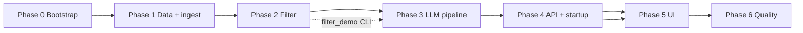

# Zomato-Cursor — Phase-Wise Implementation Plan

This plan turns [problemStatement.md](./problemStatement.md) and [architecture.md](./architecture.md) into **ordered, shippable phases**. Each phase ends with verifiable deliverables before the next begins.

**Legend:** `[ ]` = task checkbox for tracking during build.

**Sequence reference:** Runtime behavior is specified in architecture [§6 Recommendation flow](./architecture.md#6-recommendation-flow). Phases below map directly to those diagrams and step numbers.

**Evaluation:** Sign off each phase using [eval/README.md](./eval/README.md) and the matching `eval/phase-N-eval.md` before starting the next phase.

**Edge cases:** Implementation and testing should cover cases in [edgecase.md](./edgecase.md) for the active phase.

---

## Overview



| Phase | Name | Primary outcome | Architecture alignment |
|-------|------|-----------------|------------------------|
| **0** | Project bootstrap | Runnable repo, config, tooling | §1, §8.1, §10.1, §12 |
| **1** | Data pipeline | Parquet + `RestaurantStore` | §4.2 ingest, §6.3 ingest sequence, §7 |
| **2** | Filtering & domain | Hard filters + `NoMatchResponse` (no LLM) | §6.2 steps 13–22, §4.2 `FilterService` |
| **3** | LLM pipeline | Orchestrator: prompt → LLM → validate → map | §6.2 steps 23–48, §6.4.2, §6.5, §6.6, §9 |
| **4** | API & startup | HTTP layer + lifespan + status codes | §6.2 steps 5–12, §6.3–6.4, §8.2, §10.2 |
| **5** | Presentation UI | Full user flow per sequence | §6.2 steps 1–4, §8.3 |
| **6** | Quality & release | Tests, docs, demo scenarios | §11.3, §13, problem statement success criteria |

**Suggested effort (solo developer):** ~2–4 days for phases 1–4; phases 0, 5–6 are lighter.

---

## Architecture §6 → implementation map

Use this table while coding to know which phase owns each sequence step.

| Architecture | Steps / flow | Phase |
|--------------|--------------|-------|
| §6.3 Ingest (one-time) | Operator runs `ingest.py` → HF → Parquet | **1** |
| §6.3 API startup | Config load → `Store.load()` → wire FilterService | **4** |
| §6.2 Detailed sequence | 1–4 UI input & loading | **5** |
| §6.2 | 5–10 Request validation → 400 | **4** |
| §6.2 | 11–12 `request_id`, orchestrator invoke | **4** |
| §6.2 | 13–18 Filter + cap candidates | **2** |
| §6.2 | 19–22 No-match short-circuit (no LLM) | **2** |
| §6.2 | 23–32 Prompt + LLM call; 502 on provider error | **3**, surfaced in **4** |
| §6.2 | 33–42 Validate + optional `repair_prompt` retry | **3** |
| §6.2 | 43–48 `ResponseMapper` + 200 response | **3**, **4** |
| §6.4.1 | Store not loaded → 503 | **4**, **5** |
| §6.4.2 | Hallucinated `restaurant_id` strip / repair | **3** |
| §6.4.3 | HTTP status summary table | **4**, **5** |

---

## Phase 0 — Project bootstrap

**Goal:** Repository layout, dependencies, and configuration per architecture §12.

**Architecture refs:** §1 (principles), §8.1 (stack), §10.1 (config), §12 (repo structure).

### Tasks

- [ ] Create directory layout: `src/zomato_cursor/` (`models/`, `data/`, `services/`, `api/`), `scripts/`, `tests/`, `ui/`, `data/processed/`
- [ ] Add `pyproject.toml` with: `datasets`, `pandas`, `pyarrow`, `pydantic`, `fastapi`, `uvicorn`, `python-dotenv`, `httpx`; dev: `pytest`, `ruff`
- [ ] Add `.gitignore` — `data/processed/`, `.env`, `__pycache__/`, `.venv/`
- [ ] Implement `config.py` — `DATA_PATH`, `MAX_CANDIDATES`, `TOP_K_DEFAULT`, budget thresholds, `LLM_*`, `MAX_REVIEW_CHARS` (architecture §10.1)
- [ ] Add `.env.example` matching architecture §10.1
- [ ] Add `README.md` — links to `problemStatement.md`, `architecture.md`, this plan
- [ ] Verify package import path for `uvicorn zomato_cursor.api.main:app`

### Deliverables

| Artifact | Path |
|----------|------|
| Package skeleton | `src/zomato_cursor/` |
| Environment template | `.env.example` |
| Project metadata | `pyproject.toml`, `README.md` |

### Acceptance criteria

- [ ] `pip install -e .` succeeds
- [ ] `from zomato_cursor.config import settings` works without `.env`
- [ ] No secrets committed

### Problem-statement alignment

Foundation for objectives 1–5; configurable LLM via env (scope: in scope).

---

## Phase 1 — Data ingestion & preprocessing

**Goal:** Implement architecture §6.3 **ingest sequence** and §7 data layer so the API can load Parquet on startup.

**Architecture refs:** §4.2 (`DatasetLoader`, `ColumnCleaner`), §6.3 (ingest flow), §7, §14 (load &lt; 2s).

### Tasks

- [ ] `data/loader.py` — `load_raw_dataset()` from `ManikaSaini/zomato-restaurant-recommendation`, split `train`
- [ ] `data/preprocessor.py` — canonical schema (architecture §4.2 table):
  - [ ] `rate` → float; `approx_cost(for two people)` → `cost_for_two`
  - [ ] `budget_band` from config thresholds (low &lt; 400, medium 400–800, high &gt; 800 ₹)
  - [ ] `city`, `location`; `cuisines` as list; booleans for `online_order`, `book_table`
  - [ ] Stable `id` (hash of `url`); `review_snippet` truncated per `MAX_REVIEW_CHARS`
  - [ ] Drop null `name`
- [ ] `scripts/ingest.py` — pipeline per §6.3: HF → Prep → `restaurants.parquet` + `metadata.json` → exit 0 + log row count
- [ ] `data/store.py`:
  - [ ] `RestaurantStore.load(parquet_path)` — in-memory DataFrame
  - [ ] `get_by_ids(ids)` — used later by `ResponseMapper` (§6.2 step 44–45)
  - [ ] `is_loaded()` / `assert_loaded()` — for §6.4.1 503 path
- [ ] Unit tests: rate, cost, budget_band parsers (architecture §13)

### Deliverables

| Artifact | Path |
|----------|------|
| Ingest CLI | `scripts/ingest.py` |
| Processed data | `data/processed/restaurants.parquet`, `metadata.json` |
| Store | `src/zomato_cursor/data/store.py` |

### Acceptance criteria

- [ ] `python scripts/ingest.py` completes (network once); ~51.7k rows in metadata
- [ ] `RestaurantStore.load()` in &lt; 2s (architecture §14)
- [ ] Canonical columns match §4.2 table
- [ ] Re-run ingest is idempotent

### Manual verification

```text
python scripts/ingest.py
python -c "from zomato_cursor.data.store import RestaurantStore; s=RestaurantStore.load(); print(len(s.df), 'loaded=', s.is_loaded())"
```

### Problem-statement alignment

- Objective 2: Hugging Face source of truth  
- Workflow §1: Load, preprocess, cache  
- Fields listed in problem statement “Data source” section  

---

## Phase 2 — Domain models & filtering (no LLM)

**Goal:** Implement §6.2 steps **13–22** — hard filters, candidate cap, `NoMatchResponse` without any LLM call.

**Architecture refs:** §5 (models), §4.2 `FilterService`, §7.4 (location), §6.2 (13–22), §6.5 (orchestrator branch: empty candidates).

### Tasks

- [ ] `models/preferences.py` — `UserPreferences` (architecture §5.1): `location` required; optional `budget`, `cuisine`, `min_rating`, `additional_preferences`, `top_k`
- [ ] `models/restaurant.py` — canonical `Restaurant`
- [ ] `models/response.py`:
  - [ ] `FilterSummary`, `NoMatchResponse` (message + suggestions per §6.2 step 20)
  - [ ] `ErrorResponse` stub (used in phases 3–4)
- [ ] `services/filter_service.py`:
  - [ ] `location_match`: `city` OR `location` contains (case-insensitive)
  - [ ] `min_rating`, `budget_band`, `cuisine` (any token match)
  - [ ] Sort `rating DESC`, `votes DESC`; cap `MAX_CANDIDATES` (default 25)
- [ ] `services/no_match_builder.py` (or method on orchestrator stub): suggestions — relax rating, broaden location, change cuisine
- [ ] Wire `FilterService` → `RestaurantStore`
- [ ] Unit tests: each filter dimension, empty set, cap at N
- [ ] **Optional:** `scripts/filter_demo.py` for manual §6.2 steps 13–18 without API

### Deliverables

| Artifact | Path |
|----------|------|
| Models | `src/zomato_cursor/models/` |
| Filter + no-match | `src/zomato_cursor/services/filter_service.py` |
| Tests | `tests/test_filter_service.py`, `tests/test_preprocessor.py` |

### Acceptance criteria

- [ ] `Banashankari` + `North Indian` + `medium` + `min_rating=4.0` → non-empty capped list
- [ ] Impossible combo → `NoMatchResponse` with suggestions (not exception, **no LLM**)
- [ ] Every row satisfies all applied hard constraints; count ≤ `MAX_CANDIDATES`
- [ ] `pytest` green for filter + preprocessor tests

### Problem-statement alignment

- Objective 3: Structured filtering  
- Integration layer (problem statement §3): hard filters + cap  
- Guardrail: no fabricated venues; empty → message not LLM (problem statement §4)  

---

## Phase 3 — LLM pipeline (orchestrator core)

**Goal:** Implement §6.2 steps **23–48** and §6.5 pseudocode inside `recommend()` — without HTTP (CLI/script testable).

**Architecture refs:** §4.2 (`PromptBuilder`, `LLMClient`, `OutputValidator`, `ResponseMapper`), §6.2 (23–48), §6.4.2, §6.5, §6.6, §9.

### Tasks

- [ ] `services/prompt_builder.py`:
  - [ ] `build(candidates, preferences)` — system rules (grounded JSON only), user prefs, candidate JSON (§9.1)
  - [ ] `repair_prompt(raw_response, validation_errors)` — §6.2 steps 35–37
  - [ ] Token limits: `MAX_CANDIDATES`, `MAX_REVIEW_CHARS` (§9.2)
- [ ] `services/llm_client.py`:
  - [ ] Provider adapter; env `LLM_PROVIDER`, `LLM_MODEL`, `LLM_API_KEY`, timeout
  - [ ] Return `LLMRawResponse` or raise `LLMError` (retryable — §6.2 steps 29–32)
- [ ] `services/validator.py`:
  - [ ] Parse JSON; strip markdown fences
  - [ ] Ground `restaurant_id` to candidate set (§6.4.2 — strip unknown ids)
  - [ ] Enforce `top_k`; `retry_budget` default 1
  - [ ] Partial valid set allowed if ≥ 1 id remains after strip
- [ ] `services/response_mapper.py`:
  - [ ] `to_dto()` — `get_by_ids`, attach rank/explanation/match_highlights
  - [ ] Build `FilterSummary` + `meta` (`candidate_count`, `llm_model`, `latency_ms`) — §6.2 steps 43–47
- [ ] `services/orchestrator.py` — match §6.5 pseudocode:
  - [ ] `filter` → empty → `NoMatchResponse`
  - [ ] else `prompt` → `llm.complete` → `validate` → optional `repair` → `mapper.to_dto`
  - [ ] If still no valid rankings after retry → `ErrorResponse` (§6.2 steps 38–41)
- [ ] `tests/fixtures/llm_response.json` + mock LLM client
- [ ] `tests/test_validator.py` — unknown id stripped; empty triggers repair path
- [ ] `tests/test_orchestrator.py` — mock LLM: success, no-match, hallucination partial, repair retry

### Deliverables

| Artifact | Path |
|----------|------|
| Orchestrator + services | `src/zomato_cursor/services/` |
| Fixtures + tests | `tests/fixtures/`, `tests/test_orchestrator.py` |

### Acceptance criteria

- [ ] Mock LLM → `RecommendationResponse` with `rank`, `explanation`, optional `summary`
- [ ] Hallucinated id in fixture → stripped or repair invoked (§6.4.2)
- [ ] `LLMError` propagates for API to map to 502 (phase 4)
- [ ] Manual live test (`@pytest.mark.integration`): Banashankari prefs → grounded explanations
- [ ] Default `pytest` uses mock only (no network)

### Manual verification

```text
python -c "
from zomato_cursor.models.preferences import UserPreferences
from zomato_cursor.services.orchestrator import recommend
prefs = UserPreferences(location='Banashankari', cuisine='North Indian', budget='medium', min_rating=4.0, additional_preferences='family friendly')
print(recommend(prefs))
"
```

### Problem-statement alignment

- Objective 4: LLM rank + explain + optional summary  
- Success criterion 3: Readable explanations referencing user input  
- §6.6 JSON schema contract implemented in validator  

---

## Phase 4 — REST API, request validation & startup

**Goal:** Wrap orchestrator in FastAPI; implement §6.3 **API startup** and §6.4 **HTTP paths** (400 / 502 / 503 / 200).

**Architecture refs:** §6.2 (5–12, 39–40), §6.3, §6.4, §8.2, §10.2, §10.4.

### Tasks

- [ ] `api/main.py`:
  - [ ] Lifespan per §6.3: load config → `RestaurantStore.load(DATA_PATH)` → wire singleton into `FilterService`
  - [ ] On missing Parquet: log warning; `is_loaded()` false
- [ ] `api/dependencies.py` (or inline) — **Request Validator**: Pydantic `UserPreferences` + business rules (§6.2 steps 7–10)
- [ ] `api/routes.py`:
  - [ ] `GET /api/v1/health` — include `store_loaded: bool`
  - [ ] `POST /api/v1/recommendations`:
    - [ ] §6.4.1: if not `store.is_loaded()` → **503** + “Run scripts/ingest.py”
    - [ ] Invalid body → **400** + field errors
    - [ ] `request_id` + timer (§6.2 steps 11–12)
    - [ ] Call `orchestrator.recommend()`
    - [ ] `NoMatchResponse` → **200**
    - [ ] `RecommendationResponse` → **200**
    - [ ] `LLMError` / unprocessable LLM → **502** (§6.4.3)
  - [ ] **Optional:** `GET /api/v1/metadata`, `GET /api/v1/cuisines`
- [ ] Structured logging: `request_id`, `candidate_count`, `llm_latency_ms` (§10.4)
- [ ] `tests/test_api.py` — health; recommend 200 (mock LLM); 400 missing location; 503 store not loaded

### Deliverables

| Artifact | Path |
|----------|------|
| FastAPI app | `src/zomato_cursor/api/` |
| API tests | `tests/test_api.py` |

### Acceptance criteria

Implement every row in architecture **§6.4.3 Response path summary**:

| Condition | HTTP | Phase 4 test |
|-----------|------|----------------|
| Invalid request body | 400 | `test_api` missing `location` |
| Store not loaded | 503 | `test_api` without parquet / mock store |
| Zero filter matches | 200 `NoMatchResponse` | mock or integration |
| LLM timeout / provider error | 502 | mock `LLMError` |
| Unparseable JSON after retry | 502 | mock orchestrator |
| Success | 200 `RecommendationResponse` | mock LLM fixture |

- [ ] `uvicorn zomato_cursor.api.main:app --reload` + OpenAPI `/docs`
- [ ] curl example in README works

### Example request

```bash
curl -X POST http://localhost:8000/api/v1/recommendations \
  -H "Content-Type: application/json" \
  -d '{"location":"Banashankari","budget":"medium","cuisine":"North Indian","min_rating":4.0,"additional_preferences":"quiet ambiance","top_k":5}'
```

### Problem-statement alignment

- Success criteria 1 & 4: API preference flow; re-run without re-ingest  
- In scope: empty filters + API failures (problem statement scope)  

---

## Phase 5 — Presentation UI

**Goal:** Implement §6.2 steps **1–4** and all UI branches (success, no_match, error, 503).

**Architecture refs:** §8.3, §6.2 (1–4, 19–22, 29–32, 38–41, 441–442), §6.4.1, §6.4.3.

### Decision (pick one at phase start)

| Option | Pros | Cons |
|--------|------|------|
| **A — Streamlit** (`ui/app.py`) | Fastest; matches portfolio scope | Less customizable |
| **B — React + Vite** | Polished UX | More setup |

**Default:** Streamlit → `POST /api/v1/recommendations` only (no LLM keys in browser — architecture trust boundary).

### Tasks

- [ ] Preference form: location (required), budget, cuisine, min rating, additional preferences, top_k
- [ ] Client-side: required location (§6.2 step 3)
- [ ] States per architecture §8.3: `idle` → `loading` (step 6) → `success` | `no_match` | `error`
- [ ] **200 success:** cards — name, cuisines, rating, cost, explanation; optional `url`, `online_order`, `book_table` (problem statement §5)
- [ ] **200 no_match:** `NoMatchResponse` suggestions (§6.2 steps 21–22)
- [ ] **400:** show field errors from API
- [ ] **502:** retry message (§6.2 steps 31–32, 40–41)
- [ ] **503:** setup message — run ingest (§6.4.1)
- [ ] README: terminal 1 API, terminal 2 UI; link to architecture §6.2 diagram

### Deliverables

| Artifact | Path |
|----------|------|
| UI | `ui/app.py` or `ui/frontend/` |
| README | “Running the app” |

### Acceptance criteria

- [ ] Full flow without editing data files (success criterion 1)
- [ ] Cards show required fields + AI explanation (criterion 3, objective 5)
- [ ] Re-submit with new prefs without restart (criterion 4)
- [ ] Manual walkthrough matches §6.2 step reference table (1–4, then API-driven branches)

### Problem-statement alignment

- Objectives 1 & 5: User input + display  
- Optional output fields: address, url, order/book badges  

---

## Phase 6 — Quality, documentation & release readiness

**Goal:** Close problem statement **success criteria** and architecture §13 / §11.3.

**Architecture refs:** §11.2–11.3, §13, §17 traceability, problem statement success criteria & scope.

### Tasks

- [ ] `README.md`: links to all three docs; ingest → API → UI; env vars; architecture §6 overview pointer
- [ ] `pytest` coverage: preprocessor, filter, validator (hallucination), orchestrator (mock), API (400/503/502/200)
- [ ] `@pytest.mark.integration` live LLM test (skipped in CI)
- [ ] Lint/format (`ruff`); optional GitHub Actions (§11.3)
- [ ] **Optional:** Docker Compose (§11.2) with processed data volume
- [ ] Update `problemStatement.md` § Repository status → implementation complete
- [ ] Manual demo script (below) — all three scenarios pass

### Deliverables

| Artifact | Path |
|----------|------|
| Tests | `tests/` |
| CI (optional) | `.github/workflows/ci.yml` |
| Docker (optional) | `Dockerfile`, `docker-compose.yml` |

### Acceptance criteria — problem statement success criteria

| # | Criterion | Verified by |
|---|-----------|-------------|
| 1 | Enter preferences in one flow | Phase 5 UI (§6.2 steps 1–4) |
| 2 | Only dataset restaurants matching hard filters or explicit no-match | Phase 2 tests + Phase 3 validator (§6.4.2) |
| 3 | Ranked results with explanations | Phase 5 + Phase 3 integration |
| 4 | Re-run without redeploy / re-ingest | Phase 4–5 |

### Out of scope checklist (problem statement)

- [ ] No user accounts / history  
- [ ] No Zomato live API / scraping  
- [ ] No maps / payments / delivery  
- [ ] No custom ML model training  

---

## Phase dependency matrix

| Phase | Depends on | Blocks |
|-------|------------|--------|
| 0 | — | 1–6 |
| 1 | 0 | 2–6 |
| 2 | 1 | 3–6 |
| 3 | 2 | 4–6 |
| 4 | 3 | 5–6 |
| 5 | 4 | 6 (E2E) |
| 6 | 5 | — |

**Critical path:** `0 → 1 → 2 → 3 → 4 → 5 → 6`

---

## Per-phase testing checklist

| Phase | Tests | Architecture coverage |
|-------|-------|------------------------|
| 1 | `test_preprocessor.py` | §7 data quality |
| 2 | `test_filter_service.py` | §6.2 steps 13–22 |
| 3 | `test_validator.py`, `test_orchestrator.py` (mock) | §6.4.2, §6.5, §6.6 |
| 4 | `test_api.py` — 400, 503, 502, 200 | §6.4.3 table |
| 5 | Manual E2E per demo script | §6.2 full path |
| 6 | CI unit suite; integration optional | §13 |

---

## Milestone demo script (end-to-end)

Aligns with problem statement workflow and architecture §6.2.

1. `python scripts/ingest.py` — §6.3 ingest
2. `uvicorn zomato_cursor.api.main:app --port 8000` — §6.3 startup
3. `streamlit run ui/app.py`
4. **Scenario A (success):** Banashankari, North Indian, medium, rating ≥ 4.0, “family friendly” → 200 + cards
5. **Scenario B (success):** Bangalore, Italian, high budget → different ranked set
6. **Scenario C (no-match):** strict filters in narrow locality → 200 + suggestions, confirm no LLM hallucination
7. **Scenario D (setup):** API without ingest → 503 in UI

---

## Traceability matrix

| Problem statement | Architecture | Phase |
|-------------------|--------------|-------|
| Hybrid recommender (3 layers) | §1, §3 | 2, 3, 5 |
| HF dataset | §4.2, §7, §6.3 | 1 |
| Preprocess fields | §4.2, §7 | 1 |
| User preferences | §5.1 | 2, 4, 5 |
| Hard filters + cap | §4.2, §6.2 (13–18), §9.2 | 2 |
| No-match, no LLM | §6.2 (19–22), §6.5 | 2 |
| LLM rank + explain + summary | §6.2 (23–32), §9 | 3 |
| JSON contract + validator | §6.6, §6.4.2 | 3 |
| Repair retry | §6.2 (35–37) | 3 |
| ResponseMapper + meta | §6.2 (43–47) | 3 |
| REST API + paths | §8.2, §6.4.3 | 4 |
| Request validation 400 | §6.2 (7–10) | 4 |
| Startup + 503 | §6.3, §6.4.1 | 1, 4 |
| LLM failure 502 | §6.2 (29–32), §6.4.3 | 3, 4 |
| UI states + cards | §8.3, §6.2 (1–4) | 5 |
| Env LLM config | §10.1 | 0, 3 |
| Logging | §10.4 | 4 |
| Tests & CI | §13, §11.3 | 1–4, 6 |
| Success criteria 1–4 | Problem statement §139–146 | 5, 6 |
| Non-goals | §15, problem scope | 6 |

---

## Suggested sprint order

```text
Day 1 AM  → Phase 0
Day 1 PM  → Phase 1 (ingest + store + get_by_ids)
Day 2 AM  → Phase 2 (filter + NoMatchResponse + tests)
Day 2 PM  → Phase 3 (prompt, LLM, validator, mapper, orchestrator + repair)
Day 3 AM  → Phase 4 (lifespan, routes, 400/503/502, API tests)
Day 3 PM  → Phase 5 (Streamlit + all UI branches)
Day 4     → Phase 6 (README, demo scenarios A–D, optional CI/Docker)
```

---

## Document references

- [problemStatement.md](./problemStatement.md) — context, workflow, success criteria, scope  
- [architecture.md](./architecture.md) — components, **§6 sequence diagrams**, APIs, deployment  
- [edgecase.md](./edgecase.md) — edge cases by layer with severity and phase owner  
- [eval/README.md](./eval/README.md) — phase sign-off process and index  
- [implementationPlan.md](./implementationPlan.md) — this file  
