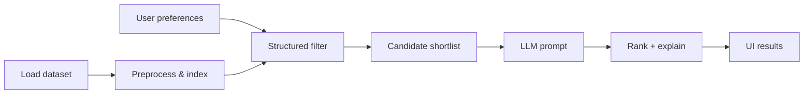

# Zomato-Cursor: AI-Powered Restaurant Recommendation

## Project context

This repository is a **greenfield build** of an AI-assisted restaurant discovery experience inspired by [Zomato](https://www.zomato.com). Zomato and similar platforms help users choose where to eat from thousands of listings. Raw search filters (location, price, cuisine) return long, interchangeable lists; users still struggle to pick a place that fits *their* situation—budget, taste, occasion, and soft preferences like “quiet” or “good for families.”

**Zomato-Cursor** addresses that gap by combining:

1. **Structured retrieval** over a real restaurant dataset (hard constraints: city, budget band, cuisine, minimum rating).
2. **A Large Language Model (LLM)** that ranks candidates, explains trade-offs, and surfaces recommendations in natural language—similar to a knowledgeable friend, not a spreadsheet.

The project is intentionally scoped as a **learning / portfolio application**: one dataset, one recommendation flow, and a clear UI for preferences and results. It is not a production clone of Zomato (no accounts, payments, live menus, or delivery logistics).

---

## Problem we are solving

### User pain

When choosing a restaurant, users often:

- Face **too many options** in a single city or neighborhood.
- Apply **multiple criteria at once** (cost, cuisine, rating, ambiance, dietary needs) that simple sort/filter UIs do not express well.
- Want **reasoning**—“why this place for tonight?”—not only names and star ratings.

Keyword search and rigid filters narrow the list but do not **prioritize** or **justify** choices for a specific intent (e.g., “date night under ₹800 for two in Banashankari with North Indian food and rating ≥ 4.0”).

### Our approach

Build a **hybrid recommender**:

| Layer | Role |
|--------|------|
| **Data + rules** | Load and clean restaurant records; filter by explicit user constraints so the LLM only sees plausible candidates. |
| **LLM** | Rank filtered restaurants, explain fit, and optionally summarize top picks in conversational prose. |
| **Presentation** | Show structured fields (name, cuisine, rating, cost) plus AI-generated explanations. |

This keeps recommendations **grounded in real data** (reducing hallucinated venues) while using the LLM for **personalization and explanation** where traditional search falls short.

---

## Objectives

Design and implement an application that:

1. Accepts **user preferences** (location, budget, cuisine, minimum rating, and optional free-text needs).
2. Uses the **Zomato restaurant dataset** from Hugging Face as the single source of truth.
3. **Filters** restaurants deterministically from structured fields.
4. **Invokes an LLM** with a curated prompt so it can rank and explain recommendations.
5. **Displays** top results in a clear, user-friendly format.

---

## Data source

| Property | Detail |
|----------|--------|
| **Dataset** | [ManikaSaini/zomato-restaurant-recommendation](https://huggingface.co/datasets/ManikaSaini/zomato-restaurant-recommendation) on Hugging Face |
| **Size** | ~51.7k rows (single `train` split) |
| **Format** | CSV / Parquet via `datasets` |
| **Geography** | Primarily Indian cities (e.g., Bangalore neighborhoods such as Banashankari, Basavanagudi); `listed_in(city)` and `location` are key for place-based filtering |

### Fields relevant to the product

Use and normalize fields such as:

- **Identity & place:** `name`, `address`, `location`, `listed_in(city)`, `url`
- **Discovery:** `cuisines`, `dish_liked`, `rest_type`, `listed_in(type)`
- **Quality & popularity:** `rate`, `votes`, `reviews_list`
- **Cost:** `approx_cost(for two people)` (map to low / medium / high budget bands in the app)
- **Operations:** `online_order`, `book_table`, `phone`
- **Rich text (optional for prompts):** `reviews_list`, `menu_item`

Preprocessing should handle missing values, inconsistent `rate` strings (e.g. `4.1/5`), and cost parsing so filters and LLM context are reliable.

---

## System workflow

### 1. Data ingestion

- Load the dataset from Hugging Face.
- Clean and type-cast critical columns (ratings, cost, cuisines, location).
- Persist or cache processed data locally if needed for fast repeat queries.

### 2. User input

Collect:

| Input | Examples |
|--------|----------|
| **Location** | City or area (e.g., Bangalore, Banashankari) |
| **Budget** | Low / medium / high (derived from cost for two) |
| **Cuisine** | Italian, Chinese, North Indian, … |
| **Minimum rating** | e.g., 3.5+ |
| **Additional preferences** | Free text: family-friendly, quick service, quiet ambiance, vegetarian-friendly, … |

### 3. Integration layer

- Apply **hard filters** on structured fields to produce a candidate set (with a sensible cap, e.g. top N by votes/rating).
- Serialize candidates into a **compact, consistent JSON or table** for the LLM.
- Build a **prompt template** that includes user goals, filter summary, and candidate rows; instruct the model to rank, cite only listed restaurants, and explain each pick.

### 4. Recommendation engine (LLM)

The LLM should:

- **Rank** restaurants against stated preferences.
- **Explain** why each recommendation fits (and note trade-offs when relevant).
- Optionally **summarize** the shortlist in one paragraph.

Guardrails: if no candidates pass filters, return a clear message and suggest relaxing constraints—not fabricated venues.

### 5. Output display

For each recommended restaurant, show at minimum:

- Restaurant name  
- Cuisine(s)  
- Rating  
- Estimated cost (for two)  
- **AI-generated explanation** tying the choice to user input  

Optional: address, online order / table booking, link to Zomato URL from dataset.

---

## Success criteria

The project is successful when a user can:

1. Enter preferences in one flow without editing raw data files.
2. Receive **only restaurants that exist in the dataset** and satisfy stated hard filters (or an explicit “no matches” state).
3. See **ranked recommendations with readable explanations** that reference their inputs.
4. Re-run with different preferences without redeploying or manually reloading the full CSV.

---

## Scope and non-goals

**In scope**

- Dataset load, preprocess, filter, LLM recommendation, and results UI (CLI or web—implementation choice left to the build).
- Configurable LLM provider/API key via environment variables.
- Basic error handling for empty filters and API failures.

**Out of scope (for now)**

- User accounts, saved history, or collaborative filtering across users  
- Real-time Zomato API integration or scraping  
- Maps, reservations, payments, or delivery tracking  
- Training a custom ML ranking model (LLM + rules is sufficient for v1)

---

## Repository status

**Phase 0 complete:** Python package bootstrap (`src/zomato_cursor/`, config, API stub, tests). Data pipeline and recommendation flow are implemented in later phases per [implementationPlan.md](./implementationPlan.md).

---

## References

- [architecture.md](./architecture.md) — system design and sequence diagrams  
- [implementationPlan.md](./implementationPlan.md) — phased implementation  
- [edgecase.md](./edgecase.md) — edge cases and expected behavior  
- [eval/README.md](./eval/README.md) — phase evaluation criteria  
- Dataset: https://huggingface.co/datasets/ManikaSaini/zomato-restaurant-recommendation  
- Product inspiration: https://www.zomato.com  
